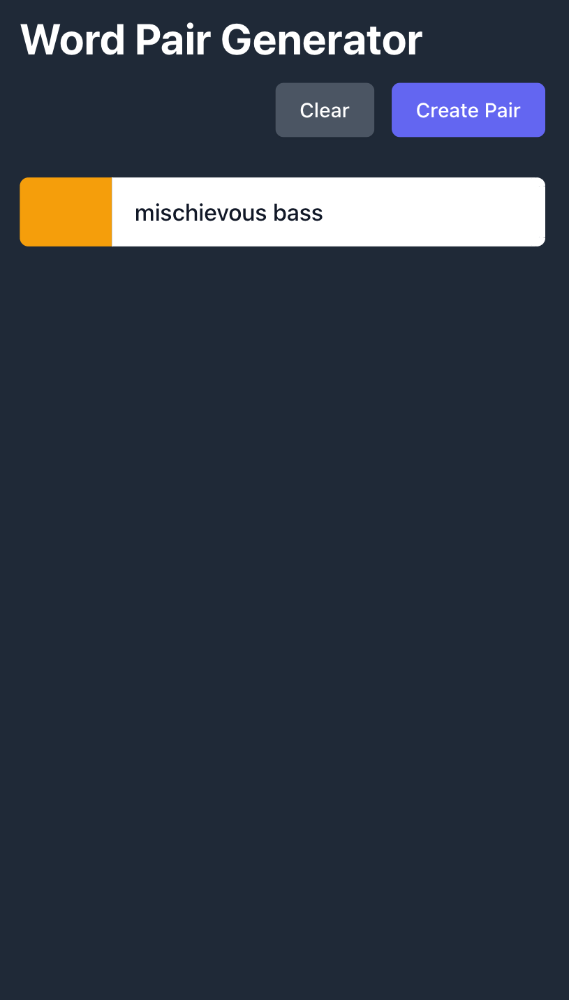
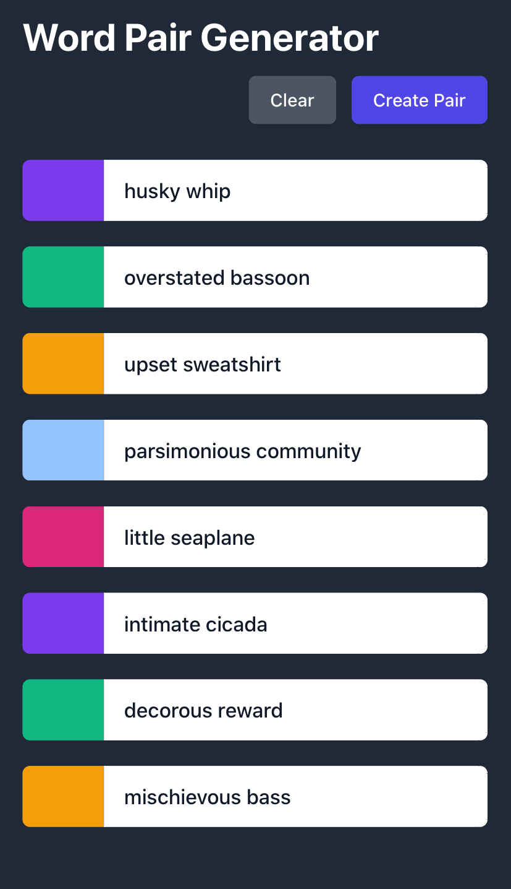
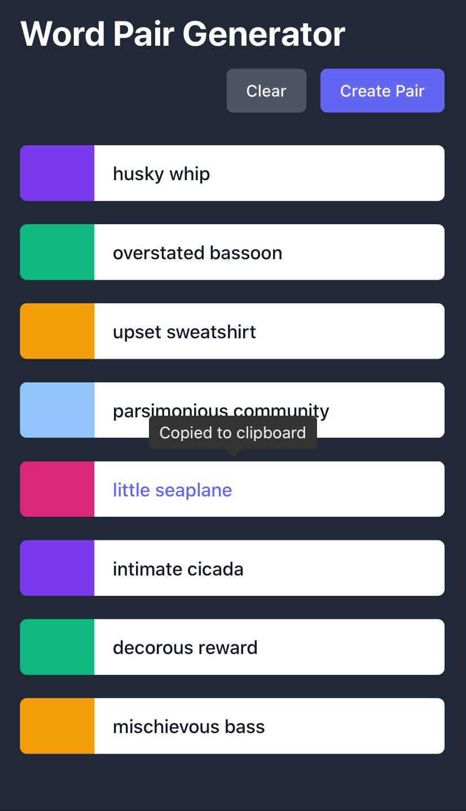

Random Username Generator
========
v.3.0 June 2021

v.2.0 Feb 2019

------------------

## Version 3.0 of a project which generates a random username using vanilla JavaScript and tailwind.css .

Link to [live application](https://taco-tues-on-a-fri.github.io/random-username-generator/)

### Overview:
Creates random two/three word phrases from a curated dataset.

### State of project:
The project is live with a basic interface. I eventually want to remake it with React and add additional functionality.

### How to use:
- Navigate to the application by clicking [here](https://taco-tues-on-a-fri.github.io/random-username-generator/).
- The page will generate and display the first word set.
- Click 'Create Pair' to get another random set.
- Clicking on any of the word pairs in the list will copy that pair to the clipboard.

#### 🌮taco-tues-on-a-fri