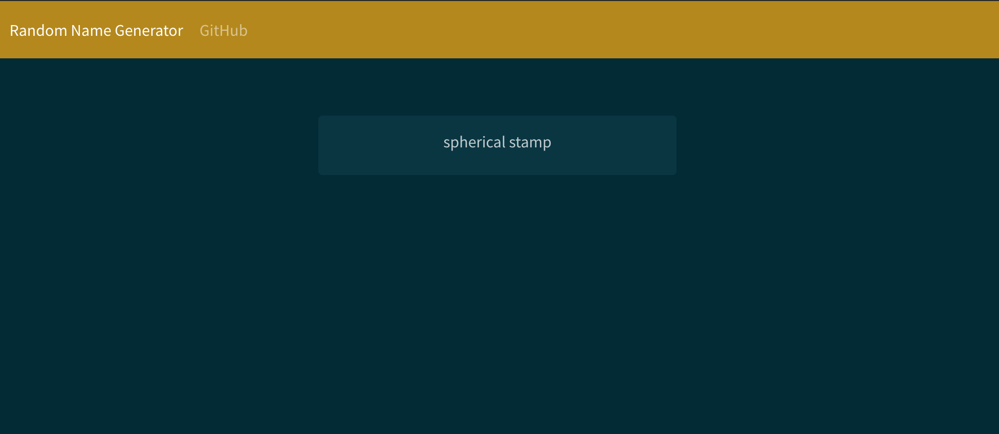

Random Username Generator
========
Feb 2019 - Present
------------------

## Version 2.0 of a project which generates a random username using vanilla JavaScript and a bootstrap font-end.

Link to [live application](https://taco-tues-on-a-fri.github.io/random-username-generator/)

### Overview:
Creates random two+ string phrases by pulling from a dataset of compiled and cleaned words.

### State of project:
The project is live with a basic interface. I have plans to implement a dynamic version using React in the near future.

### How to use:
- Navigate to the application by clicking [here](https://taco-tues-on-a-fri.github.io/random-username-generator/).
- The page will generate and display the first word set.
- Click on the generated words to get another random set.
- Clicking on any of the historical words in the list below will automatically copy them to the clipboard.

### Design decisions:
I created the application to help make different random usernames when creating accounts online. I built the randomizer function while traveling and then gave it a basic interface one afternoon. I frequently use this application and found that a button to copy to clipboard would be really useful.
I am looking forward to giving this application a React interface for it. 

#### 🌮taco-tues-on-a-fri